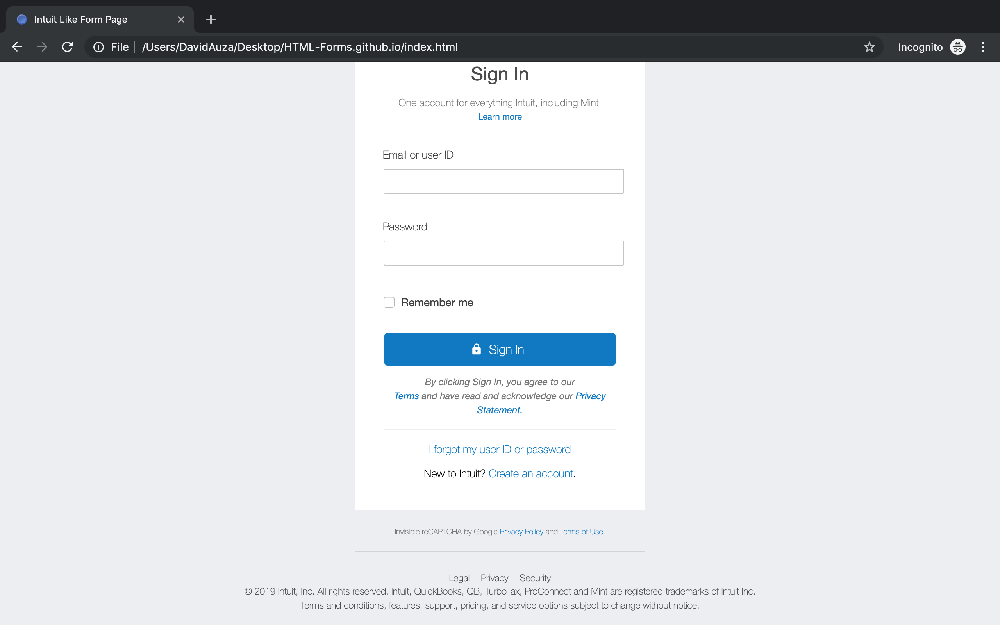

# HTML-Forms

This is our solution to Microverse's second project. It is a clone of the mint.com signing in page. The original page is found [here](https://accounts.intuit.com/index.html?offering_id=Intuit.ifs.mint&namespace_id=50000026&redirect_url=https%3A%2F%2Fmint.intuit.com%2Foverview.event%3Futm_medium%3Ddirect%26cta%3Dnav_login_dropdown%26adobe_mc%3DMCMID%253D76274335738205239611162157411886537202%257CMCAID%253D2E9B870905079DDA-60000112400111CE%257CMCORGID%253D969430F0543F253D0A4C98C6%252540AdobeOrg%257CTS%253D1563938195%26ivid%3D68e82987-67ee-4066-a3a1-bada41eba343). It is created using HTML5 and CSS3.

Project contributors:

- David Auza
- Eduardo Reis

## Screenshots

### Screenshot 1

### Screenshot 2

